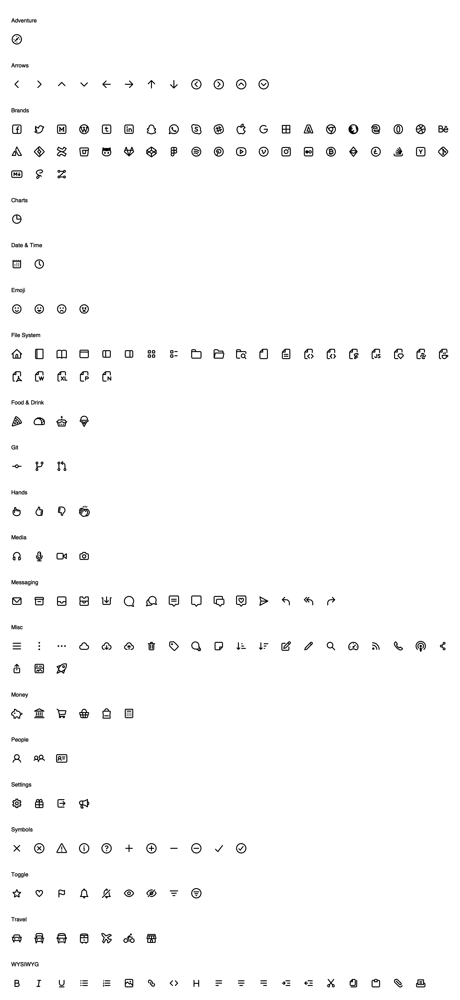

Zest Free 
=========

200 premium icons meticulously handcrafted and lovingly optimized for web and mobile.

## Preview



## Installation

    npm install --save zest-free

## Usage

### 1) SVG usage

All of the Zest Free icons are available in SVG and PNG format in the `images`
directory of the package. Icons are organized by category and UID. You can
browse the files [here](https://github.com/32pixelsCo/zest-free/tree/master/packages/zest-free/images).

To use the SVG files in your project, reference them like you would any other
NPM package file.

### 2) JavaScript usage

Zest also includes a JavaScript file that contains all of the SVG paths for
the icons. Include `zest-free.js` in your project like you would any other NPM
library. If you're using Webpack with Babel this looks like this:

```javascript
import ZestIcons from 'zest-free'
```

The API for Zest is simple. All of the icons can be referenced by UID like this:

```javascript
ZestIcons['smiling-face'] /* => Returns the Smiling Face Emoji */
```

This returns an object for each icon that looks like this:

```javascript
{
  index: 57,
  uid: 'smiling-face',
  name: 'Smiling Face',
  category: 'emoji',
  paths: '<path fill-rule="evenodd" clip-rule="evenodd" d="M4 12a8 8 0 1 1 16 0 8 8 0 0 1-16 0zm8-10C6.477 2 2 6.477 2 12s4.477 10 10 10 10-4.477 10-10S17.523 2 12 2zM9.967 14.744a1 1 0 0 0-1.937.498C8.469 17 10.283 18 12 18c1.785 0 3.452-1.012 3.97-2.76a1 1 0 0 0-1.937-.496C13.773 15.614 12.84 16 12 16c-.84 0-1.772-.385-2.033-1.256zM10.5 10a1.5 1.5 0 1 1-3 0 1.5 1.5 0 0 1 3 0zm4.5 1.5a1.5 1.5 0 1 0 0-3 1.5 1.5 0 0 0 0 3z"/>',
  keywords: [ 'smile', 'happy', 'laugh', 'out loud', 'lol' ],
  packages: [ 'zest-social', 'zest-free' ],
  previous: 'pie-chart',
  next: 'grinning-face'
}
```

Using this API you can construct an SVG string for an icon like this:

```javascript
var paths = ZestIcons['smiling-face'].paths
var iconString = '<svg width="24" height="24" viewBox="0 0 24 24">' + paths + '</svg>'
```

With a bit more imagination, you can create a function for constructing icon
elements like this:

```javascript
function createIconElement(uid, options) {
  if (!(uid in ZestIcons)) { throw new Error('Invalid UID for icon: ' + uid) }
  var options = options || {}
  var size = options.size || 24
  var color = options.color || '#000'
  var className = options.className || ''
  var style = options.valign ? 'valign:' + options.valign : ''
  var paths = ZestIcons[uid].paths
  var div = document.createElement('div')
  div.innerHTML = '<svg width="' + size + '" height="' + size + '" viewBox="0 0 24 24" class="' + className + '" style="' + style + '"><g fill="' + color + '">' + paths + '</g></svg>'
  return div.children[0]
}

var el = document.getElementById('example')
var icon = createIconElement('smiling-face', {color: '#f09', size: 48, valign: 'middle'})
el.appendChild(icon)
```

Or, if you're using React, you can create and use an `Icon` component like this:

```javascript
import React from 'react'
import ZestIcons from 'zest-free'

const Icon = ({uid, size=24, color='', valign, className}) => {
  let paths
  let style = {}
  if (uid in ZestIcons) {
    paths = ZestIcons[uid].paths
  } else {
    throw new Error('Invalid UID for icon: ' + uid)
  }
  if (valign) {
    style['verticalAlign'] = valign
  }
  return (
    <svg width={size} height={size} viewBox="0 0 24 24" className={className} style={style}>
      <g fill={color} dangerouslySetInnerHTML={{ __html: paths }} />
    </svg>
  )
}

const MyPage = () => <div>
  <h1>
    Hello Zest!
    <Icon uid="smiling-face" color="#f09" size="48" valign="middle" />
  </h1>
</div>
```

## License

Zest Free is freely available under the MIT License. View the complete license [here](./LICENSE.md).
